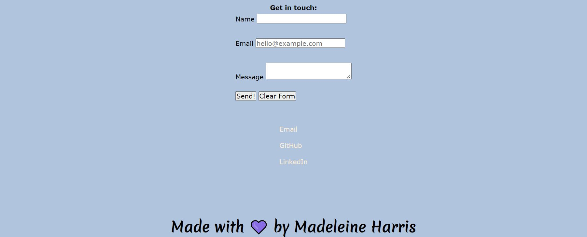

# Madeleine's Professional Portfolio
See how I spend my time and what areas matter most to me

## Table of Contents

- [Description](#description)
- [Deployed Application](#deployed-application)
- [Installation](#installation)
- [Usage](#usage)
- [Credits](#credits)
- [License](#license)

## Description

This professional portfolio serves as a the central location for all current projects. Read about who I am, glimpse my work, and contact me all within a concise and efficient layout. With links to other professional sources like LinkedIn and Github, you can explore the scope of my capacity as a budding developer.

## Deployed Application

https://miss-mad.github.io/miss-mad-portfolio/

## Installation

No installation necessary.

## Usage

Below are screenshots of my portfolio website.

## Credits

List of resources used:

https://css-tricks.com/couple-takes-sticky-footer/

https://unsplash.com/

https://getbootstrap.com/docs/5.0/layout/breakpoints/

https://www.internetingishard.com/html-and-css/responsive-design/#css-media-queries

https://developer.mozilla.org/en-US/docs/Web/CSS/Attribute_selectors#syntax

https://www.simplilearn.com/tutorials/html-tutorial/html-mailto#:~:text=You%20can%20create%20an%20HTML,%E2%80%9Cmailto%E2%80%9D%20parameter%20after%20it.&text=If%20you%20want%20to%20send,email%20address%20with%20a%20comma.

## License

No licenses.

---